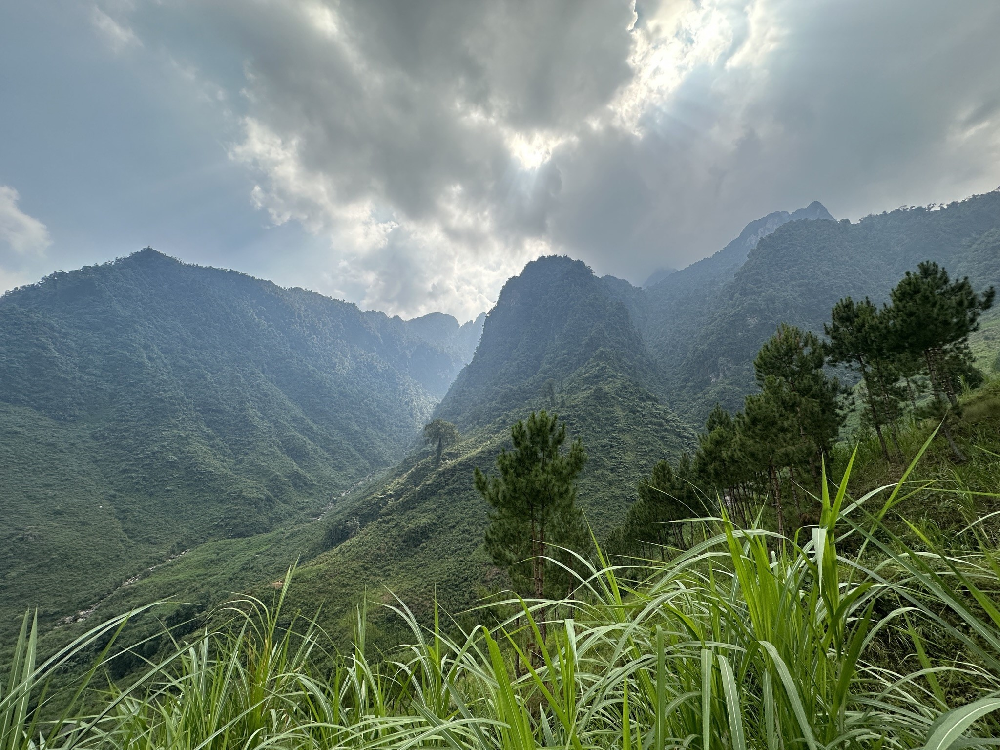
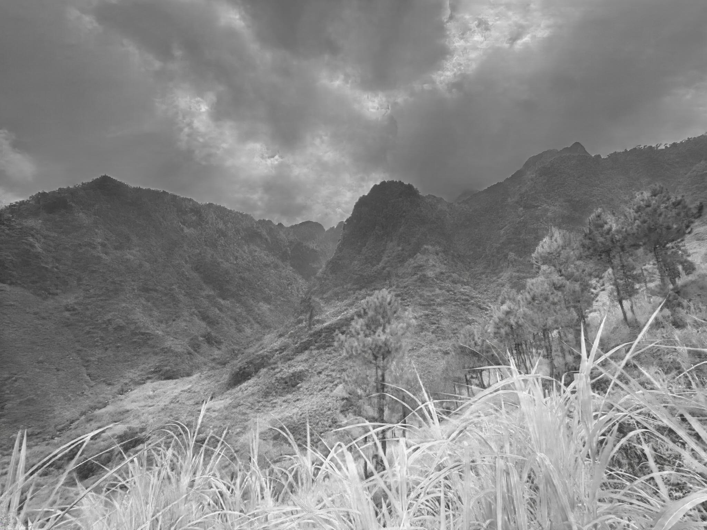
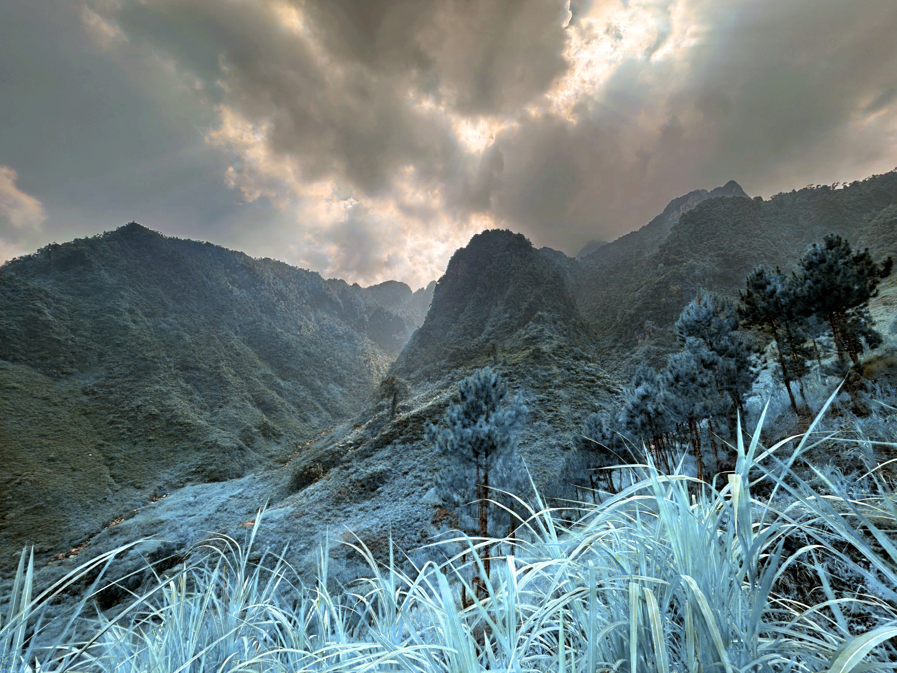
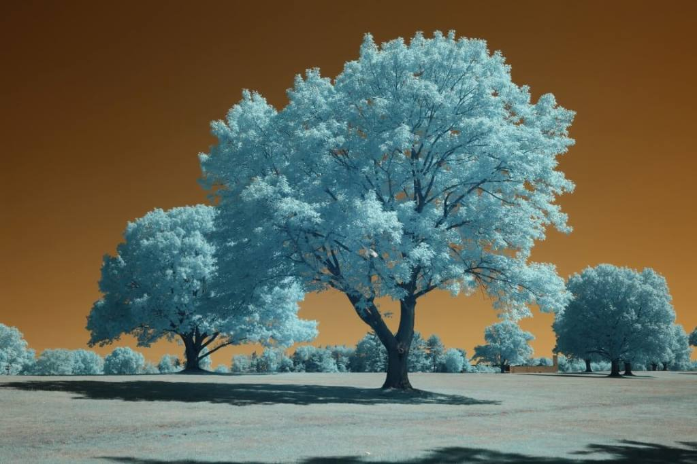

# RGB2Spectral
Converting RGB photographs into full spectrum photography with Pix2PixHD and spectral reconstruction

Unstructured local experimentation.

# Sample RGB:

# Sample Generated NIR:
 

# Composite 590nm through manual spectral reconstruction based on spectral response of generic camera sensor:

# Example of in camera 590nm:

https://kolarivision.com/wp-content/uploads/2022/05/590CWB-Medium-Small-Custom.jpg

# TODO:
  &emsp;Programatic spectral reconstruction and filtering
  &emsp;Set up structured workflow 
  &emsp;Code cleanup 
  &emsp;Documentation 
